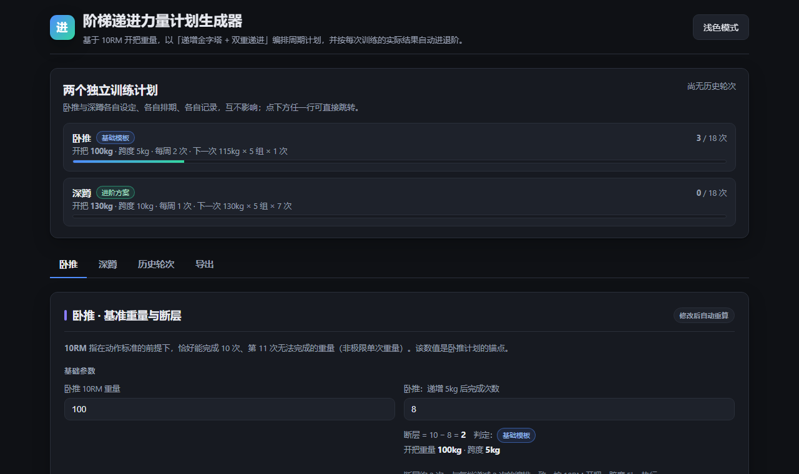

# 阶梯递进力量计划生成器

**Ladder Progression Strength Planner** · 一个纯前端、离线可用的力量训练周期计划生成器

> **计划来源**：本程序的训练计划模板来自抖音创作者 **小鸡仔**。
> 视频给出的编排是：以 10RM 为开把重量、每档 5 组、每递增一档次数递减 2 次、
> 小循环 1–4 的开把档次数依次为 7 / 8 / 9 / 10，以及按「断层」判定进退阶。
> 本项目只是把这套规则**程序化**（自动排期、按实际训练结果重算、记录与导出），
> 计划本身的著作权归原作者，如原作者有任何异议请联系删除。

输入卧推 / 深蹲的 10RM 基准重量，自动排出「递增金字塔 + 双重递进」的完整周期计划，
并根据每次训练**实际完成的次数**自动判定进阶或退阶，实时重算后续所有安排。

## 开始使用

**在线版（推荐，手机可直接用）**

**https://yemijun.github.io/ladder-progression/**

打开网址即可。手机可在浏览器菜单里「添加到主屏幕」，之后像 App 一样全屏打开、断网也能用。

**离线版**

下载 `index.html`，用浏览器打开就行 —— 整个应用就是这一个文件，
不需要安装、不需要联网、不需要后端。

### 第一次使用：三步

1. 打开「卧推」页 → 填「10RM 重量」和「递增 5kg 后完成次数」
   （不知道怎么测？页面上有「测试方法」照着做）
2. 切到「深蹲」页 → 同样填一遍（深蹲是递增 10kg）
3. 看「周训练日程」，按表开练

两个动作完全独立：各有各的设定、日程、记录，改一个不影响另一个。
某个动作暂时不练，把它的「每周训练次数」设为「暂停」即可。

## 每次练完要做什么

到对应动作的「训练记录」→ 填「实际完成次数（最难的一组）」→ 点「记录本次训练」，后续日程会自动重算：

| 情况 | 下一次训练 |
|---|---|
| 达标（做满规定次数） | 进入下一档重量 |
| 没达标 | 重做同一个重量档 |
| 同一档连续 2 次没达标 | 重量下调 5kg，并从本小循环的开把档重新走 |

「连续未达标多少次后下调」可以在「基准重量与断层」里改成 1 / 2 / 3 次。
每次训练只执行**一个重量档**，用这个重量做满 **5 组**；组间休息固定 **3 分钟**。

## 一轮练完之后

「本轮进度」里会出现「保存本轮训练记录」，点它就把这一整轮归档到「历史轮次」。
归档后可以重命名、单独导出图片 / CSV / JSON，也可以随时删除。
两个动作分别归档、互不影响。

## 计划原理

这套模板没有单一的公开正式名称，它由三种有正式名称的成熟方法组合而成，本项目的命名也由此而来：

| 特征 | 方法 | 参考 |
|---|---|---|
| 循环内重量递增、次数递减 | **递增金字塔** Ascending Pyramid | [金字塔法则](https://wapbaike.baidu.com/item/%E9%87%91%E5%AD%97%E5%A1%94%E6%B3%95%E5%88%99/10682142) |
| 跨小循环先加次数再加重量 | **双重递进** Double Progression | [Double Progression](https://legionathletics.com/double-progression/) |
| 按断层判定进退阶 | **自动调节** Autoregulation | [IJSPT 负荷自动调节综述](https://ijspt.org/wp-content/uploads/2021/01/2015_V10N6_Complete.pdf) |

具体规则：

- **开把重量**取 10RM（恰好能完成 10 次、第 11 次做不动的重量）
- 每次训练只练**一个重量档**，做满 **5 组**
- 每递增一档，次数递减 **2** 次，直到 **1** 次
- **断层** = 10 − 递增一档后能完成的次数
  - 卧推：断层 ≥ 3 → 退阶（开把 −5kg）；断层 ≤ 1 → 进阶（跨度换 10kg）
  - 深蹲：断层 ≥ 5 → 退阶（开把 −5kg）；断层 ≤ 2 → 进阶（跨度换 10kg）
- **未达标**则下次重做同一档；同一档**连续 2 次未达标** → 重量下调 5kg，并从当前小循环开把档重走

## 备份与换设备

记录只保存在**使用者本机浏览器**里，清理浏览器数据会丢失，建议定期备份：

- **导出**：「导出」页 → 最下方「导出备份文件（JSON）」
- **恢复**：在新设备打开本页 → 「选择备份文件（.json）」→「确认导入」
  - **合并导入**：保留新设备已有数据，把备份并进来（同一文件重复导入不会重复）
  - **覆盖导入**：清空新设备数据，完全按备份恢复（含全部设定）

## 功能

- **卧推与深蹲完全独立**：各自设定、各自排期、各自记录，互不影响
- **实时重算**：录入每次训练的实际完成次数，后续日程立刻更新
- **断层检测**：按 10RM 自动判定基础 / 退阶 / 进阶三种模式，并给出计算示例
- **整轮归档**：练完一轮可保存到「历史轮次」，支持重命名、批量导出 CSV / JSON、导出图片、删除
- **多格式导出**：PNG 图片（可 1×/2×/3×、可固定深浅配色）、打印 / PDF、CSV
- **备份与转移**：一键导出 JSON 备份，可在另一台设备完整恢复（合并导入幂等）
- **深浅色主题**、**手机端适配**

## 数据与隐私

所有训练记录只保存在**使用者本机浏览器的 localStorage** 中，
页面不联网、不上传任何数据到服务器，托管方也看不到任何人的记录。

## 常见问题

**数据会和别人共享吗？**
不会。所有记录只存在你自己的浏览器里，页面不联网、不上传任何数据。

**换了浏览器，数据还在吗？**
不在。只有同一个浏览器才共享本地数据；换浏览器请用备份文件迁移。

**在线版和离线版的数据互通吗？**
不互通。两者的浏览器存储是相互独立的，需要用「导出备份文件（JSON）」手工迁移。

**手机上能看到电脑上的数据吗？**
不能，每台设备各自独立，同样用备份文件迁移。

**想打印或存 PDF？**
「导出」页有「打印 / 导出 PDF」，只会输出你勾选的模块。

**为什么导出的图片里没有按钮和输入框？**
这是有意设计的：图片和 PDF 只保留内容，不保留交互元素。

**深浅色主题？**
右上角按钮切换，会记住你的选择。

## 文件说明

| 文件 | 作用 |
|---|---|
| `index.html` | 主程序（整个应用就这一个文件） |
| `manifest.webmanifest` | PWA 清单，支持「添加到主屏幕」 |
| `sw.js` | Service Worker，首次访问后离线可用 |
| `icon-192.png` / `icon-512.png` / `apple-touch-icon.png` | 应用图标 |
| `screenshot.png` | 上面那张界面预览图 |
| `.nojekyll` | 关闭 GitHub Pages 的 Jekyll 处理 |

## 技术

原生 JavaScript + 内联 CSS，**零依赖、零构建**。
PNG 导出走 `XMLSerializer` → `foreignObject` → `<canvas>`，不依赖任何绘图库。

核心计划逻辑（纯函数、无 DOM 依赖）集中在 `index.html` 的 `CORE-START` / `CORE-END`
标记之间，可直接抽取出来做单元测试。

## 声明

本项目仅供参考，不构成训练或医疗建议。开始任何训练计划前请评估自身状况，动作标准优先于重量。

## 许可

MIT
